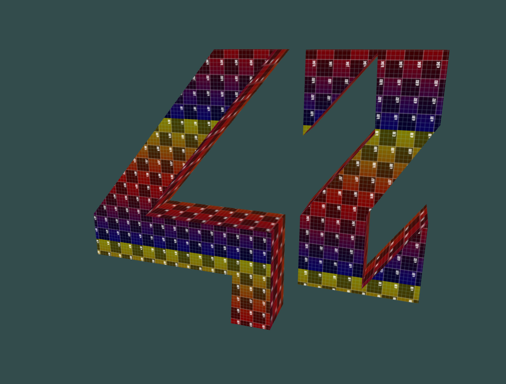
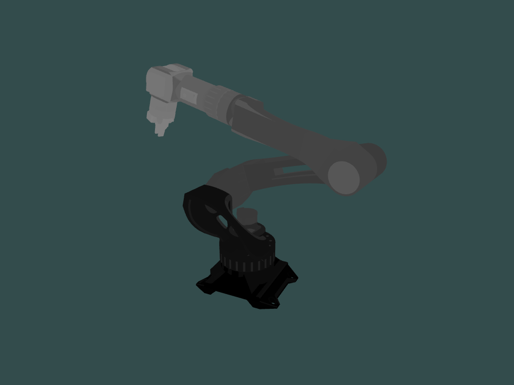
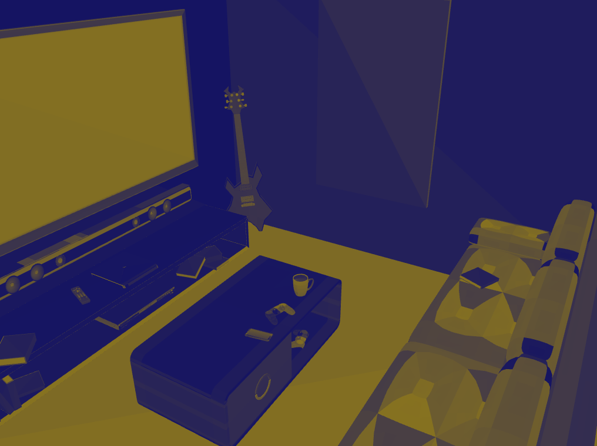
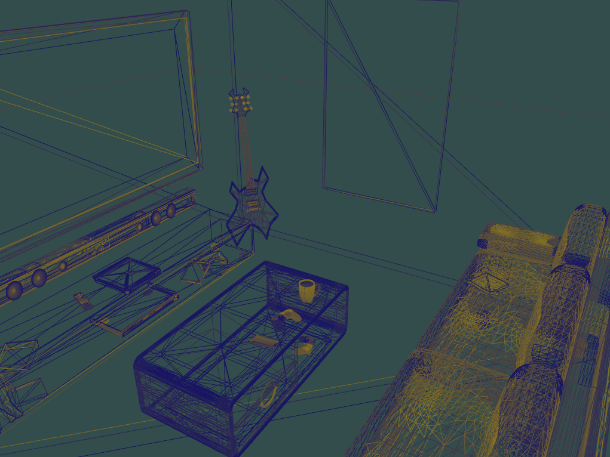

# Scop

## Introduction
The aim of the project is to create a small 3D object visualization program based on the .obj file format.

42 subject: https://cdn.intra.42.fr/pdf/pdf/134427/fr.subject.pdf

The technical constraints are as follows:
- You are free to use the language of your choice (`C` / C++ / Rust recommended)
- You are free to use either : `OpenGL`, Vulkan, Metal and MinilibX.
- Have a normal Makefile (whatever you're used to putting in it)
- Use external libraries (other than OpenGL, Vulkan or Metal) ONLY for
window and event management. You have the right to use your own libft.

## Inputs
You can change the display mode between:
  - Wireframe `W`
  - Point `P`
  - Standard/Fill `F`

Change the top axis between Y and Z: `A`
Enable/Disable auto-rotation: `R`
Enable/Disable the texture movement and the color shifting: `M`
Enable/Disable the texture: `T`
Enable/Disable the color: `C`
Reset camera to default: `SPACE`

## Run program
The program uses a Makefile to compile.

`make` / `make re`

Usage:
`./scop object.obj texture.bmp`

> [!WARNING]
> My program automatically triangulates non-triangular faces.
> Triangulation program don't work with concave, non-coplanar and holes polygons..

You can find objects and textures in the resources folder:
`./scop resources/42.obj resources/tester.bmp`
  

